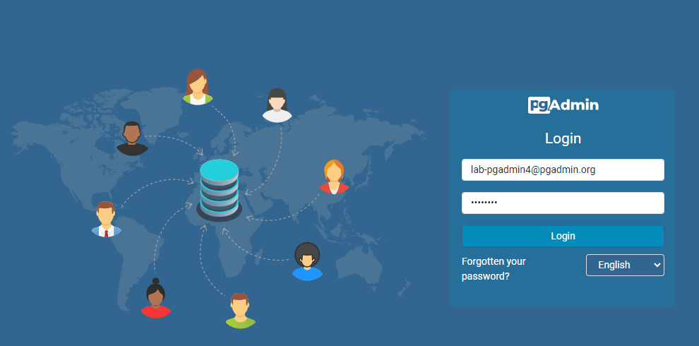
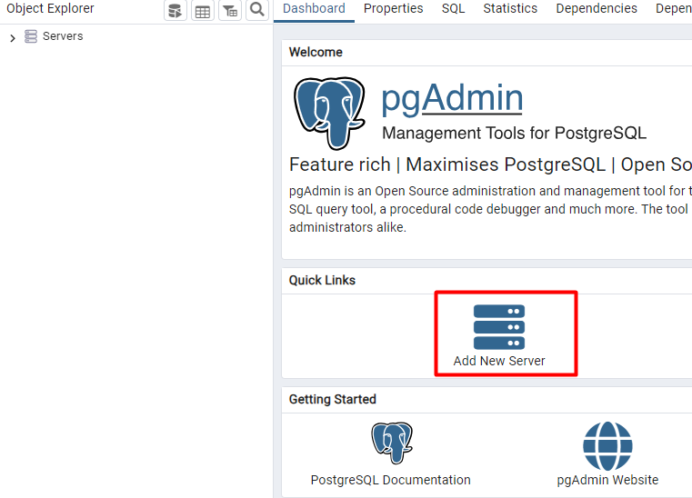

# Lab Eda - Kafka Connect


## Disclaimer
> **As configurações dos Laboratórios é puramente para fins de desenvolvimento local e estudos**


## 💻 Pré-requisitos
* Docker
* Docker-Compose


## Kafka Connect


### Realizando download dos plugins para os conectores


Criando a imagem junto com o plugin do Debezium Postgres


```bash
docker image build -t <<usuario>>/kafka-connet-fia:1.0.1  -f Dockerfile . 
```

Imagem criada? ...mas antes

Altere o arquivo `docker-compose.yaml` da imagem criada no serviço `connect`

```bash
docker-compose up -d zookeeper kafka-broker connect postgres pgadmin minio

docker container ls
```

Listando os plugins existentes, os padrões da imagem e do debezium que foi inserido na imagem, via arquivo `Dockerfile`

```bash
docker exec -it kafkaConect curl  http://localhost:8083/connector-plugins
```

## Configurando o Conector Postgres

> [!IMPORTANT]
> Configuração do PostgreSql para replicação


```sql
SHOW config_file;
SHOW wal_level;
SHOW max_replication_slots;
```

### Provisionando Banco de dados PostgreSql e a ferramenta PgAdmin


Acesso para o PgAdmin http://localhost:5433/


* Login: lab-pgadmin4@pgadmin.org
* Senha : postgres    

* Nome do server: postgres
* Nome do Host Name: postgres
* database: postgres
* Username: postgres
* password: postgres

### Tela de login do PgAdmin



### Inserindo um server


### Configurando o server


### ...Se tudo deu certo o banco de exemplo com suas tabelas


### Criando os Conectores

*API rest do kafka Connect*
https://docs.confluent.io/platform/current/connect/references/restapi.html


# Configuração


Criando o conector PostGreSql

```bash
curl -X PUT -d @conector-postgres.json http://localhost:8083/connectors/connector-postgres/config -H 'Content-Type: application/json' -H 'Accept: application/json'


//Ou via powershell
$response = Invoke-WebRequest -Uri "http://localhost:8083/connectors/connector-postgres/config" -Method Put -Body (Get-Content -Path "conector-postgres.json" -Raw) -ContentType "application/json"; $response.Content


```


* Observando o arquivo `conector-postgres.json` 

Algumas informações básicas sobre o connector:


* `spec.class`: Nome da classe do conector que está dentro do plugin debezium
* `spec.config.database.hostname` e `spec.config.database.port`: endereço IP ou nome de host para sua instância Sql Server, bem como a porta (por exemplo 1433)
* `spec.config.database.user` e `spec.config.database.password`: nome de usuário e senha para sua instância Sql Server
* `spec.config.database.dbname`: nome do banco de dados
* `spec.config.database.server.name`: Nome lógico que identifica e fornece um namespace para o servidor / cluster de banco de dados Sql Server específico que está sendo monitorado.
* `spec.config.table.whitelist`: lista separada por vírgulas de regex especificando quais tabelas você deseja monitorar para a captura de dados alterados


Listando os conectores

```bash
docker exec -it kafkaConect curl http://localhost:8083/connectors/
```

Verificando o status dos conectores

```bash
docker exec -it kafkaConect curl http://localhost:8083/connectors/connector-postgres/status

```

### Testando o Conector

Vamos inserir alguns registros nas tabelas e listar os tópicos do Kafka


### Inserir um registro na tabela `inventory.products`


> Para entrar nos scripts, botão direito na tabela clica em `Query Tool`

```sql
INSERT INTO inventory.products(	id, name, description, weight)
VALUES (default, 'Lapis', 'O melhor', 1);
```

Listando os tópicos


```bash
docker exec -it kafka-broker /bin/bash
kafka-topics --bootstrap-server localhost:9092 --list 
```


*Consumindo mensagem postgres.inventory.products Datasource Postgres*

```bash
kafka-console-consumer --bootstrap-server localhost:9092 --topic postgres.inventory.products --from-beginning
```


#### Api Rest Kafka Connect


```bash
exit

docker exec -it kafkaConect curl http://localhost:8083/connectors/connector-postgres/status

```

Interagindo com os connetores

```
Método PUT http://localhost:8083/connectors/connector-postgres/pause
Método GET http://localhost:8083/connectors/connector-postgres/status
Método PUT http://localhost:8083/connectors/connector-postgres/resume
```

### Configurando MinIO


Acesso para o MinIO http://localhost:9001/login

* Senha : admin
* password: minioadmin


### Configurando o MinIO


Instalando o conector do MinIO

> Não esqueçam de mudar os campos  `aws.access.key.id` e `aws.secret.access.key` do arquivo `conector-minio.json`

```bash

curl -X PUT -d @conector-minio.json http://localhost:8083/connectors/connector-minio/config -H 'Content-Type: application/json' -H 'Accept: application/json'


//Ou via powershell
$response = Invoke-WebRequest -Uri "http://localhost:8083/connectors/connector-minio/config" -Method Put -Body (Get-Content -Path "conector-minio.json" -Raw) -ContentType "application/json"; $response.Content


```

Listando os conectores

```bash
docker exec -it kafkaConect curl http://localhost:8083/connectors/
```

Será que deu certo??

Vamos inserir um novo registro na tabela products no banco de dados do Postgres

```sql
INSERT INTO inventory.products(	id, name, description, weight)
VALUES (112, 'Lapis', 'O melhor', 1);
```

## Enviando informações para a camada Silver

 --colocar alguma coisa sobre o duckdb

### Subindo o ambiente do Jypyter

```bash
docker compose up -d jupyter_service

```

> [!IMPORTANT]
> Olhe os logs para pegar o endereço do Jupyter

## Abra o arquivo `ingest_silver.ipynb` que está dentro da pasta


### Para acessar a linha de comando do duckdb


### Algumas query para ingestão para a camada Gold

```sql
-- Filtrar dados de 2025
CREATE OR REPLACE TABLE gold_products_2025 AS
SELECT 
    id,
    name,
    description,
    weight,
    time,
    hour,
    month,
    year
FROM silver_table
WHERE year = 2025
ORDER BY time DESC;


CREATE OR REPLACE TABLE gold_product_ranking AS
SELECT 
    id,
    name,
    description,
    weight,
    time,
    hour,
    month,
    year,
    RANK() OVER (PARTITION BY month, year ORDER BY weight DESC) AS weight_rank
FROM silver_table
ORDER BY year, month, weight_rank;

```